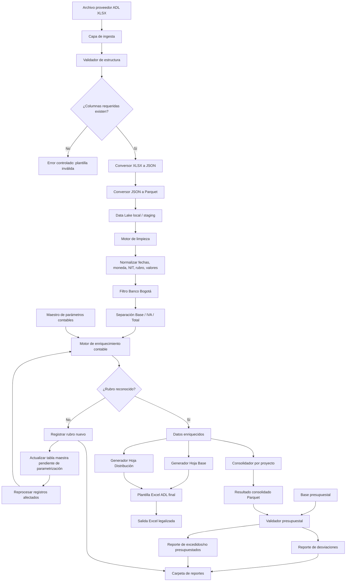

# Arquitectura individual — Módulo ADL

## Objetivo
Automatizar la legalización mensual de anticipos ADL, desde la recepción del XLSX del proveedor hasta la generación de plantilla final, validación contable, detección de rubros nuevos y cruce presupuestal.

## Arquitectura técnica



## Componentes requeridos

| Componente | Responsabilidad |
|---|---|
| Ingesta ADL | Leer archivo mensual XLSX del proveedor |
| Validador de estructura | Confirmar columnas mínimas requeridas |
| Conversor de formatos | Generar JSON y Parquet para procesamiento rápido |
| Motor de limpieza | Normalizar datos financieros y campos clave |
| Motor de exclusión | Mantener únicamente registros Banco Bogotá |
| Motor financiero | Separar base, IVA y total |
| Maestro contable | Parametrizar rubro, cuenta, material, orden, centro de costo y proyecto |
| Motor de rubros nuevos | Detectar, registrar y reprocesar servicios nuevos |
| Generador Excel | Alimentar Hoja Base y Hoja Distribución |
| Validador presupuestal | Comparar legalización contra presupuesto |
| Bitácora | Guardar errores, cambios, rubros nuevos y trazabilidad |

## Estructura sugerida del módulo

```text
adl/
├── input/
├── staging/
│   ├── json/
│   └── parquet/
├── masters/
│   ├── maestro_contable.xlsx
│   └── presupuesto.xlsx
├── output/
│   ├── excel_final/
│   └── reportes/
├── logs/
└── src/
    ├── ingest.py
    ├── transform.py
    ├── rules.py
    ├── budget_validator.py
    ├── excel_writer.py
    └── main.py
```

## Salidas esperadas

- Archivo Excel legalizado.
- Reporte de rubros nuevos.
- Reporte de diferencias presupuestales.
- Archivo Parquet procesado.
- Bitácora de ejecución.
