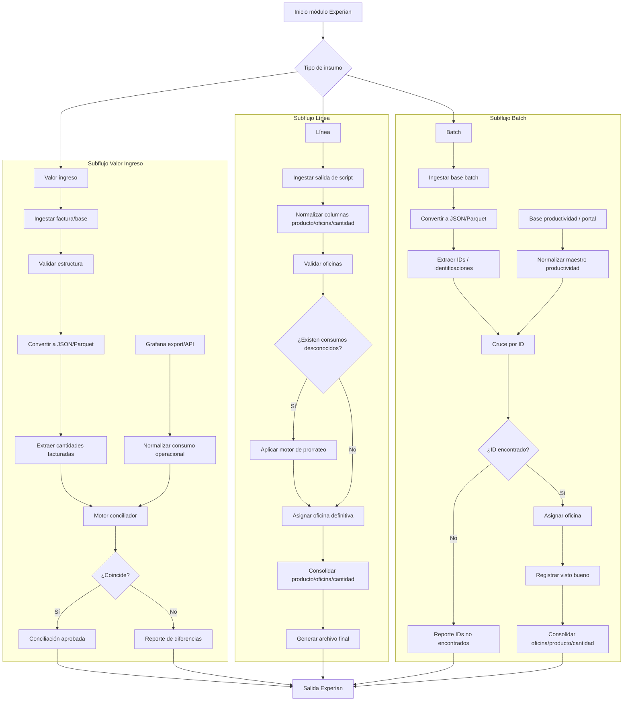

# Arquitectura individual — Módulo Experian

## Objetivo
Automatizar la conciliación de facturas y consumos Experian para los subprocesos Valor Ingreso, Línea y Batch.

## Arquitectura técnica



## Componentes requeridos

| Componente | Responsabilidad |
|---|---|
| Ingesta Experian | Leer facturas y bases de los tres subprocesos |
| Conversor JSON/Parquet | Estandarizar procesamiento rápido |
| Conector Grafana | Recibir exporte o consumir API de Grafana |
| Motor conciliador | Comparar facturado vs consumo operacional |
| Normalizador de script Línea | Estandarizar salida de terceros |
| Motor de prorrateo | Distribuir consumos desconocidos por porcentaje |
| Conector productividad | Cruzar IDs contra información de oficina/usuario |
| Motor de consolidación | Agrupar por producto, oficina y cantidad |
| Reportador | Emitir diferencias, IDs no encontrados y consolidados |

## Estructura sugerida del módulo

```text
experian/
├── input/
│   ├── valor_ingreso/
│   ├── linea/
│   └── batch/
├── staging/
│   ├── json/
│   └── parquet/
├── masters/
│   ├── productividad.xlsx
│   ├── reglas_prorrateo.xlsx
│   └── oficinas.xlsx
├── output/
│   ├── conciliaciones/
│   └── reportes/
├── logs/
└── src/
    ├── valor_ingreso.py
    ├── linea.py
    ├── batch.py
    ├── conciliator.py
    ├── prorrateo.py
    └── main.py
```

## Salidas esperadas

- Conciliación Valor Ingreso.
- Consolidado Línea por producto/oficina/cantidad.
- Consolidado Batch por oficina/producto/cantidad.
- Reporte de consumos desconocidos.
- Reporte de IDs no encontrados.
- Bitácora de ejecución.
