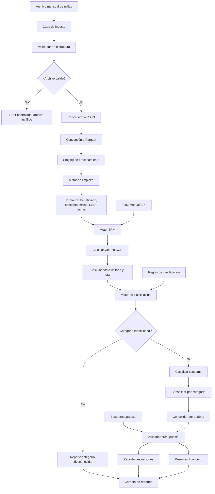

# Arquitectura individual — Módulo Millas / Dispersión

## Objetivo
Automatizar la valoración mensual de millas, su clasificación financiera y la validación contra presupuesto.

## Arquitectura técnica



## Componentes requeridos

| Componente | Responsabilidad |
|---|---|
| Ingesta Millas | Leer archivo mensual descargado |
| Conversor JSON/Parquet | Estandarizar procesamiento rápido |
| Motor de limpieza | Normalizar campos de millas, USD, beneficiario y concepto |
| Motor TRM | Obtener TRM manual o vía API |
| Motor financiero | Calcular valores en COP, costo unitario y total |
| Motor de clasificación | Clasificar persona natural, persona jurídica, bonos, tarjetas y business |
| Validador presupuestal | Comparar consumo mensual contra presupuesto |
| Generador de reportes | Emitir resumen financiero y desviaciones |

## Estructura sugerida del módulo

```text
millas_dispersion/
├── input/
├── staging/
│   ├── json/
│   └── parquet/
├── masters/
│   ├── reglas_clasificacion.xlsx
│   ├── trm.xlsx
│   └── presupuesto.xlsx
├── output/
│   ├── resumen_financiero/
│   └── reportes/
├── logs/
└── src/
    ├── ingest.py
    ├── transform.py
    ├── trm_engine.py
    ├── classifier.py
    ├── budget_validator.py
    └── main.py
```

## Salidas esperadas

- Resumen financiero mensual.
- Archivo de consumo clasificado.
- Reporte de categorías desconocidas.
- Reporte de desviaciones presupuestales.
- Archivo Parquet procesado.
- Bitácora de ejecución.
