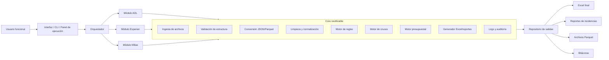

# Arquitectura core — Aplicación de automatización financiera

## Objetivo
Definir la arquitectura transversal reutilizable para los tres módulos: ADL, Experian y Millas/Dispersión.



## Estructura global sugerida del proyecto

```text
automatizacion_financiera/
├── app/
│   ├── orchestrator.py
│   ├── config.py
│   └── main.py
├── core/
│   ├── ingestion.py
│   ├── validators.py
│   ├── converters.py
│   ├── cleaners.py
│   ├── rules_engine.py
│   ├── joins.py
│   ├── budget.py
│   ├── reports.py
│   └── logger.py
├── modules/
│   ├── adl/
│   ├── experian/
│   └── millas_dispersion/
├── data/
│   ├── input/
│   ├── staging/
│   ├── masters/
│   └── output/
├── logs/
├── tests/
├── requirements.txt
└── README.md
```

## Principios de diseño

- Cada módulo debe usar el mismo core.
- Cada flujo debe producir JSON y Parquet antes de procesar grandes volúmenes.
- Las reglas de negocio deben estar parametrizadas en archivos maestros.
- Todo error debe quedar en bitácora.
- Ningún proceso debe depender de copiar y pegar manualmente.
- Los reportes deben ser reproducibles y auditables.
