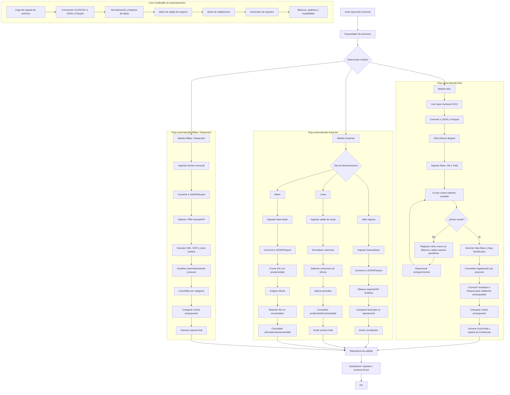

# Diagrama de flujo automatizado global — Aplicación de automatización financiera

Este documento representa la solución automatizada unificada para ADL, Experian y Millas/Dispersión.

```mermaid
flowchart TD
    A[Inicio ejecución mensual] --> B[Orquestador de procesos]
    B --> C{Seleccionar módulo}

    C --> ADL0[Módulo ADL]
    C --> EXP0[Módulo Experian]
    C --> MIL0[Módulo Millas / Dispersión]

    subgraph CORE[Core reutilizable de automatización]
        CORE1[Capa de ingesta de archivos]
        CORE2[Conversión XLSX/CSV a JSON y Parquet]
        CORE3[Normalización y limpieza de datos]
        CORE4[Motor de reglas de negocio]
        CORE5[Motor de validaciones]
        CORE6[Generador de reportes]
        CORE7[Bitácora, auditoría y trazabilidad]
    end

    %% ADL
    subgraph ADL[Flujo automatizado ADL]
        ADL0 --> ADL1[Leer base mensual XLSX]
        ADL1 --> ADL2[Convertir a JSON y Parquet]
        ADL2 --> ADL3[Filtrar Banco Bogotá]
        ADL3 --> ADL4[Separar Base, IVA y Total]
        ADL4 --> ADL5[Cruzar contra maestro contable]
        ADL5 --> ADL6{¿Rubro existe?}
        ADL6 -- No --> ADL7[Registrar rubro nuevo en bitácora y tabla maestra pendiente]
        ADL7 --> ADL8[Reprocesar enriquecimiento]
        ADL8 --> ADL5
        ADL6 -- Sí --> ADL9[Generar Hoja Base y Hoja Distribución]
        ADL9 --> ADL10[Consolidar legalización por proyecto]
        ADL10 --> ADL11[Convertir resultado a Parquet para validación presupuestal]
        ADL11 --> ADL12[Comparar contra presupuesto]
        ADL12 --> ADL13[Generar Excel final y reporte de incidencias]
    end

    %% Experian
    subgraph EXP[Flujo automatizado Experian]
        EXP0 --> EXP1{Tipo de factura/insumo}
        EXP1 --> EXPA0[Valor ingreso]
        EXP1 --> EXPB0[Línea]
        EXP1 --> EXPC0[Batch]

        EXPA0 --> EXPA1[Ingestar factura/base]
        EXPA1 --> EXPA2[Convertir a JSON/Parquet]
        EXPA2 --> EXPA3[Obtener exporte/API Grafana]
        EXPA3 --> EXPA4[Comparar facturado vs operacional]
        EXPA4 --> EXPA5[Emitir conciliación]

        EXPB0 --> EXPB1[Ingestar salida de script]
        EXPB1 --> EXPB2[Normalizar columnas]
        EXPB2 --> EXPB3[Detectar consumos sin oficina]
        EXPB3 --> EXPB4[Aplicar prorrateo]
        EXPB4 --> EXPB5[Consolidar producto/oficina/cantidad]
        EXPB5 --> EXPB6[Emitir archivo final]

        EXPC0 --> EXPC1[Ingestar base batch]
        EXPC1 --> EXPC2[Convertir a JSON/Parquet]
        EXPC2 --> EXPC3[Cruzar IDs con productividad]
        EXPC3 --> EXPC4[Asignar oficina]
        EXPC4 --> EXPC5[Reportar IDs no encontrados]
        EXPC5 --> EXPC6[Consolidar oficina/producto/cantidad]
    end

    %% Millas
    subgraph MIL[Flujo automatizado Millas / Dispersión]
        MIL0 --> MIL1[Ingestar archivo mensual]
        MIL1 --> MIL2[Convertir a JSON/Parquet]
        MIL2 --> MIL3[Obtener TRM manual/API]
        MIL3 --> MIL4[Calcular USD, COP y costo unitario]
        MIL4 --> MIL5[Clasificar automáticamente consumo]
        MIL5 --> MIL6[Consolidar por categoría]
        MIL6 --> MIL7[Comparar contra presupuesto]
        MIL7 --> MIL8[Generar reporte final]
    end

    CORE1 --> CORE2 --> CORE3 --> CORE4 --> CORE5 --> CORE6 --> CORE7

    ADL13 --> OUT[Repositorio de salidas]
    EXPA5 --> OUT
    EXPB6 --> OUT
    EXPC6 --> OUT
    MIL8 --> OUT

    OUT --> DASH[Dashboard / reportes / archivos Excel]
    DASH --> FIN[Fin]
```
