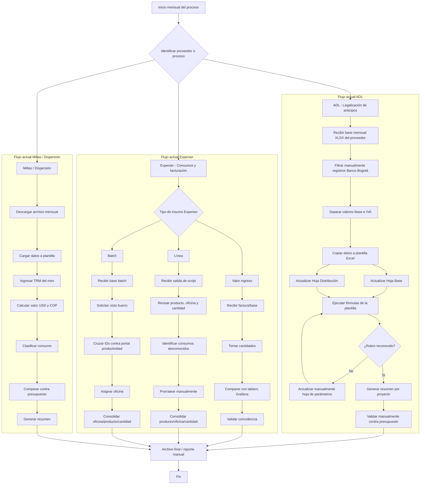

# Diagrama de flujo actual global — Automatización financiera

Este documento representa el flujo manual actual de los tres procesos principales: ADL, Experian y Millas/Dispersión.

```mermaid
flowchart TD
    A[Inicio mensual del proceso] --> B{Identificar proveedor o proceso}

    B --> ADL0[ADL - Legalización de anticipos]
    B --> EXP0[Experian - Consumos y facturación]
    B --> MIL0[Millas / Dispersión]

    %% ADL
    subgraph ADL[Flujo actual ADL]
        ADL0 --> ADL1[Recibir base mensual XLSX del proveedor]
        ADL1 --> ADL2[Filtrar manualmente registros Banco Bogotá]
        ADL2 --> ADL3[Separar valores Base e IVA]
        ADL3 --> ADL4[Copiar datos a plantilla Excel]
        ADL4 --> ADL5[Actualizar Hoja Base]
        ADL4 --> ADL6[Actualizar Hoja Distribución]
        ADL5 --> ADL7[Ejecutar fórmulas de la plantilla]
        ADL6 --> ADL7
        ADL7 --> ADL8{¿Rubro reconocido?}
        ADL8 -- No --> ADL9[Actualizar manualmente hoja de parámetros]
        ADL9 --> ADL7
        ADL8 -- Sí --> ADL10[Generar resumen por proyecto]
        ADL10 --> ADL11[Validar manualmente contra presupuesto]
    end

    %% Experian
    subgraph EXP[Flujo actual Experian]
        EXP0 --> EXP1{Tipo de insumo Experian}
        EXP1 --> EXPA0[Valor ingreso]
        EXP1 --> EXPB0[Línea]
        EXP1 --> EXPC0[Batch]

        EXPA0 --> EXPA1[Recibir factura/base]
        EXPA1 --> EXPA2[Tomar cantidades]
        EXPA2 --> EXPA3[Comparar con tablero Grafana]
        EXPA3 --> EXPA4[Validar coincidencia]

        EXPB0 --> EXPB1[Recibir salida de script]
        EXPB1 --> EXPB2[Revisar producto, oficina y cantidad]
        EXPB2 --> EXPB3[Identificar consumos desconocidos]
        EXPB3 --> EXPB4[Prorratear manualmente]
        EXPB4 --> EXPB5[Consolidar producto/oficina/cantidad]

        EXPC0 --> EXPC1[Recibir base batch]
        EXPC1 --> EXPC2[Solicitar visto bueno]
        EXPC2 --> EXPC3[Cruzar IDs contra portal productividad]
        EXPC3 --> EXPC4[Asignar oficina]
        EXPC4 --> EXPC5[Consolidar oficina/producto/cantidad]
    end

    %% Millas
    subgraph MIL[Flujo actual Millas / Dispersión]
        MIL0 --> MIL1[Descargar archivo mensual]
        MIL1 --> MIL2[Cargar datos a plantilla]
        MIL2 --> MIL3[Ingresar TRM del mes]
        MIL3 --> MIL4[Calcular valor USD y COP]
        MIL4 --> MIL5[Clasificar consumo]
        MIL5 --> MIL6[Comparar contra presupuesto]
        MIL6 --> MIL7[Generar resumen]
    end

    ADL11 --> Z[Archivo final / reporte manual]
    EXPA4 --> Z
    EXPB5 --> Z
    EXPC5 --> Z
    MIL7 --> Z
    Z --> FIN[Fin]
```
